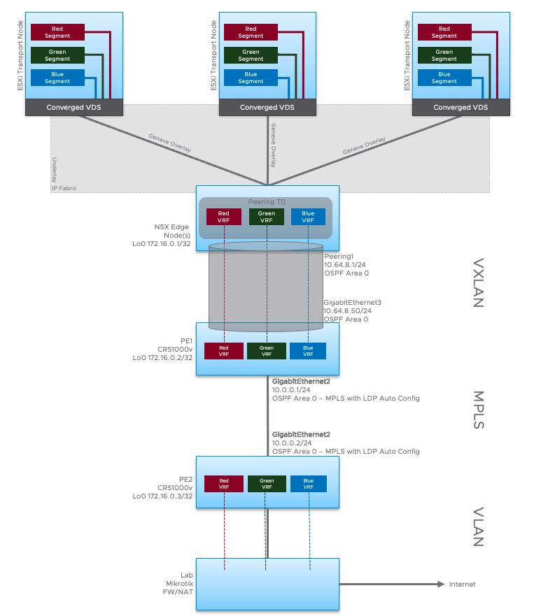

# NSX-T to Cisco using EVPN/VXLAN 

Lab notes to connect an NSX-T fabric to a single Cisco CSR1000V using MP-BGP with EVPN/VXLAN. 

Topology includes a NSX-T environment with a single T0 router called Peering that is connected to a CSR (PE1) over a single Ethernet link which has a connection to PE2 router using VPN4 and MPLS with LDP signalling. 

## Lab topology
